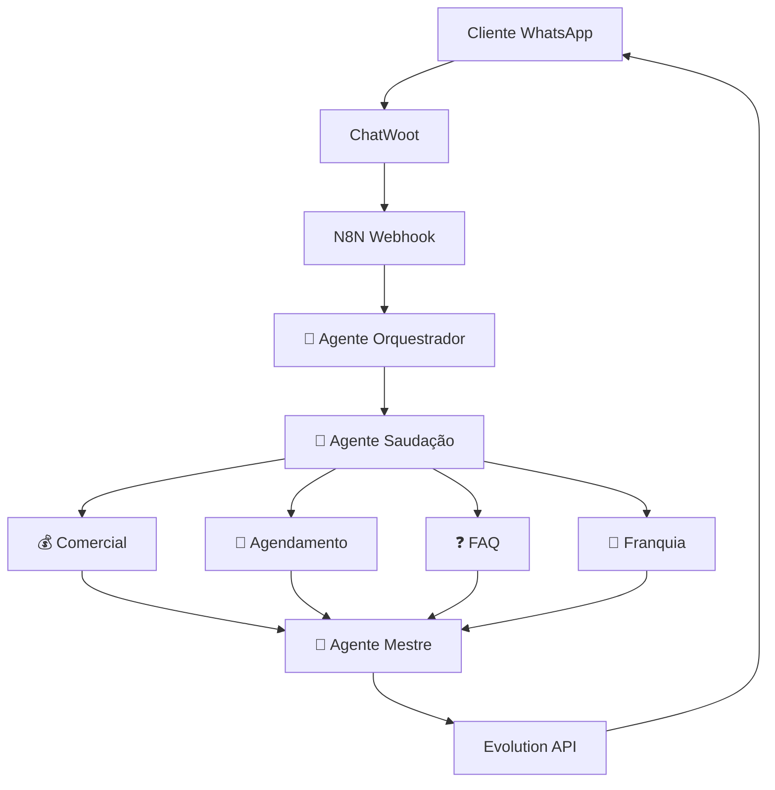

# 🎯 Bable Pet - Sistema Multiagente Dashboard

<div align="center">


[]()
[]()
[]()
[]()

**Última atualização:** `2025-09-08T19:03:17`

</div>

## 📊 Última Execução de Teste

- **ID da Execução:** `None`
- **Modo de Teste:** OTIMIZACAO
- **Status:** ✅ SUCESSO
- **Tempo de Execução:** 6.4s
- **Cenários Testados:** 3
- **Nodes Processados:** 0

## 🤖 Performance dos Agentes

| Agente | Score | Status | Última Atualização |
|--------|-------|--------|-------------------|
| Otimização 4-Agentes | 8.5/10 | 🟢 Ótimo | 2025-09-08 |
| Análise Performance | 10.0/10 | 🟢 Ótimo | 2025-09-08 |
| Qualidade | 1.0/10 | 🔴 Precisa Otimizar | 2025-09-08 |

## 🏗️ Arquitetura do Sistema



## 🚀 Status do Sistema

- **Operacional:** ✅ SIM
- **Total de Workflows:** 34
- **Workflows Ativos:** 2
- **Última Execução:** `None`

## 🛠️ Comandos de Teste

### Sistema Integrado com Dashboard
```bash
# Teste rápido com atualização do dashboard
python bable_pet_final.py --modo webhook

# Bateria completa com métricas detalhadas
python bable_pet_final.py --modo sequencial --cenarios 5

# Otimização com 4 agentes + dashboard
python bable_pet_final.py --modo otimizacao --cenarios 3

# Diagnóstico com análise completa
python bable_pet_final.py --modo diagnostico
```

## 📈 Histórico de Testes

**Execução mais recente:**
- **Timestamp:** 2025-09-08T19:03:17.642806
- **Resultado:** SUCESSO
- **Performance:** 100.0% de sucesso
- **Processamento:** 6.4s

## 🔗 Links Úteis

- [N8N Instance](https://n8n.synapseautointeligente.com.br)
- [Sistema de Testes](./bable_pet_final.py)
- [Documentação](./GUIA_FUNCIONAMENTO_COMPLETO.md)

---

<div align="center">

**🤖 Sistema atualizado automaticamente a cada execução de teste**

[](https://python.org)
[](https://n8n.io)
[](https://claude.ai)

*Dashboard atualizado: 2025-09-08T19:03:17*

</div>
