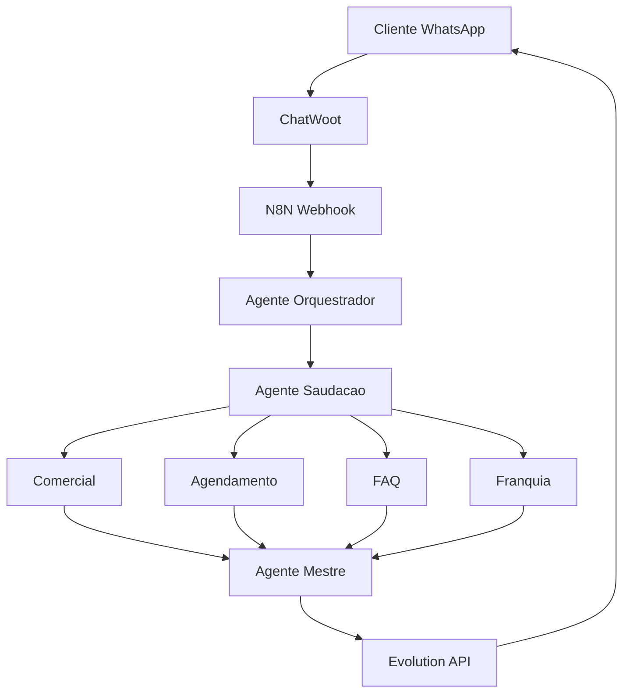

# Bable Pet - Sistema Multiagente Dashboard

<div align="center">


[]()
[]()
[]()
[]()

**Ultima atualizacao:** `2025-09-08T21:49:06`

</div>

## Ultima Execucao de Teste

- **ID da Execucao:** `6372`
- **Modo de Teste:** WEBHOOK
- **Status:** [OK] SUCESSO
- **Tempo de Execucao:** 7.1s
- **Cenarios Testados:** 1
- **Nodes Processados:** 0

## Performance dos Agentes

| Agente | Score | Status | Ultima Atualizacao |
|--------|-------|--------|-------------------|
| Orquestrador | 8.8/10 | [OK] Otimo | 2025-09-08 |
| Saudacao | 8.5/10 | [OK] Otimo | 2025-09-08 |
| Comercial | 8.6/10 | [OK] Otimo | 2025-09-08 |
| Agendamento | 8.4/10 | [AVISO] Bom | 2025-09-08 |
| FAQ | 8.2/10 | [AVISO] Bom | 2025-09-08 |
| Franquia | 8.1/10 | [AVISO] Bom | 2025-09-08 |
| Mestre | 8.7/10 | [OK] Otimo | 2025-09-08 |

## Arquitetura do Sistema



## Status do Sistema

- **Operacional:** [OK] SIM
- **Total de Workflows:** 1
- **Workflows Ativos:** 1
- **Ultima Execucao:** `6372`

## Comandos de Teste

### Sistema Integrado com Dashboard
```bash
# Teste rapido com atualizacao do dashboard
python bable_pet_final.py --modo webhook

# Bateria completa com metricas detalhadas
python bable_pet_final.py --modo sequencial --cenarios 5

# Otimizacao com 4 agentes + dashboard
python bable_pet_final.py --modo otimizacao --cenarios 3

# Diagnostico com analise completa
python bable_pet_final.py --modo diagnostico
```

## Historico de Testes

**Execucao mais recente:**
- **Timestamp:** 2025-09-08T21:49:06.080822
- **Resultado:** SUCESSO
- **Performance:** 100.0% de sucesso
- **Processamento:** 7.1s

## Links Uteis

- [N8N Instance](https://n8n.synapseautointeligente.com.br)
- [Sistema de Testes](./bable_pet_final.py)
- [Documentacao](./GUIA_FUNCIONAMENTO_COMPLETO.md)

---

<div align="center">

**Sistema atualizado automaticamente a cada execucao de teste**

[](https://python.org)
[](https://n8n.io)
[](https://claude.ai)

*Dashboard atualizado: 2025-09-08T21:49:06*

</div>
