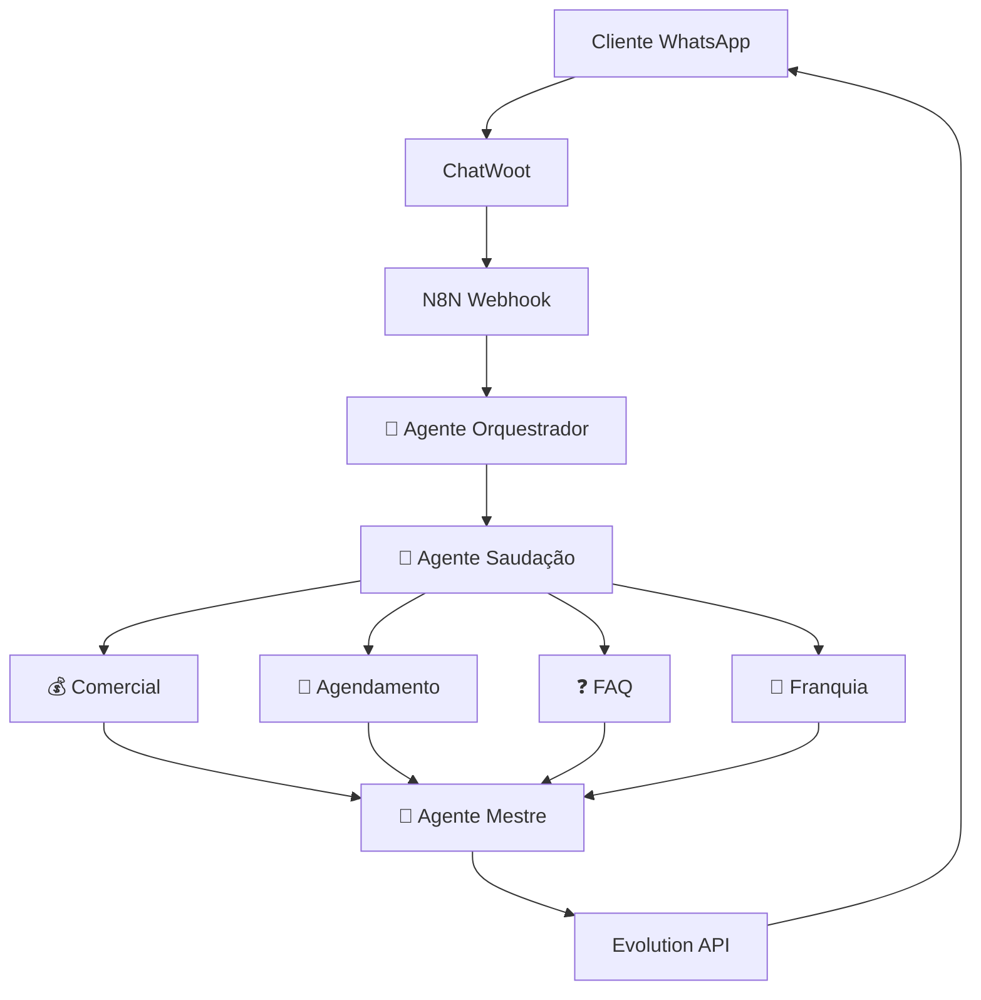

# 🎯 Bable Pet - Sistema Multiagente Dashboard

<div align="center">


[]()
[]()
[]()
[]()

**Última atualização:** `2025-09-08T16:47:04`

</div>

## 📊 Última Execução de Teste

- **ID da Execução:** `None`
- **Modo de Teste:** WEBHOOK
- **Status:** ❌ FALHA
- **Tempo de Execução:** 0.0s
- **Cenários Testados:** 1
- **Nodes Processados:** 0

## 🤖 Performance dos Agentes

| Agente | Score | Status | Última Atualização |
|--------|-------|--------|-------------------|
| 🎯 Orquestrador | 8.8/10 | 🟢 Ótimo | 2025-09-08 |
| 👋 Saudação | 8.5/10 | 🟢 Ótimo | 2025-09-08 |
| 💰 Comercial | 8.6/10 | 🟢 Ótimo | 2025-09-08 |
| 📅 Agendamento | 8.4/10 | 🟡 Bom | 2025-09-08 |
| ❓ FAQ | 8.2/10 | 🟡 Bom | 2025-09-08 |
| 🏢 Franquia | 8.1/10 | 🟡 Bom | 2025-09-08 |
| 👑 Mestre | 8.7/10 | 🟢 Ótimo | 2025-09-08 |

## 🏗️ Arquitetura do Sistema



## 🚀 Status do Sistema

- **Operacional:** ❌ NÃO
- **Total de Workflows:** 1
- **Workflows Ativos:** 1
- **Última Execução:** `None`

## 🛠️ Comandos de Teste

### Sistema Integrado com Dashboard
```bash
# Teste rápido com atualização do dashboard
python bable_pet_final.py --modo webhook

# Bateria completa com métricas detalhadas
python bable_pet_final.py --modo sequencial --cenarios 5

# Otimização com 4 agentes + dashboard
python bable_pet_final.py --modo otimizacao --cenarios 3

# Diagnóstico com análise completa
python bable_pet_final.py --modo diagnostico
```

## 📈 Histórico de Testes

**Execução mais recente:**
- **Timestamp:** 2025-09-08T16:47:04.289141
- **Resultado:** FALHA
- **Performance:** 0.0% de sucesso
- **Processamento:** 0.0s

## 🔗 Links Úteis

- [N8N Instance](https://n8n.synapseautointeligente.com.br)
- [Sistema de Testes](./bable_pet_final.py)
- [Documentação](./GUIA_FUNCIONAMENTO_COMPLETO.md)

---

<div align="center">

**🤖 Sistema atualizado automaticamente a cada execução de teste**

[](https://python.org)
[](https://n8n.io)
[](https://claude.ai)

*Dashboard atualizado: 2025-09-08T16:47:04*

</div>
