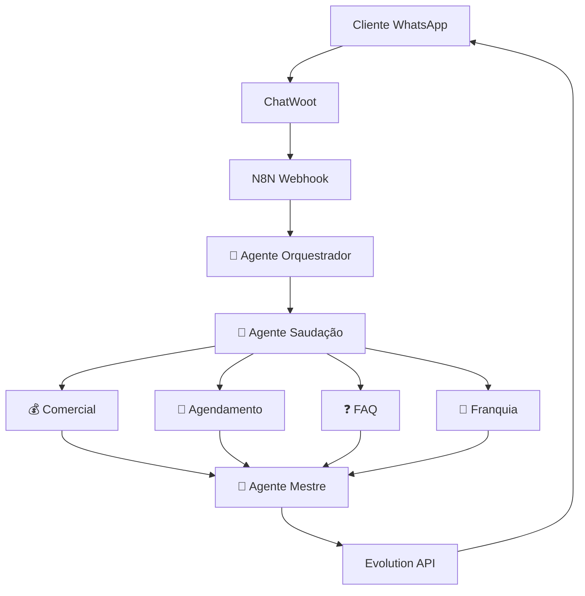

# 🎯 Bable Pet - Sistema Multiagente Dashboard

<div align="center">


[]()
[]()
[]()
[]()

</div>

## 📊 Métricas em Tempo Real

**Última atualização:** `2025-09-05 12:36:36`

### 🚀 Status Geral
- **Total de Workflows:** 0
- **Workflows Ativos:** 0
- **Nodes de IA:** 0
- **Última Execução:** `N/A`

### 📈 Performance
- **Taxa de Sucesso:** 0.0%
- **Tempo Médio de Resposta:** 0.0s
- **Total de Testes:** 0

### 🤖 Performance dos Agentes

| Agente | Score | Status | Especialidade |
|--------|-------|--------|---------------|
| 🎯 Orquestrador | 0.0/10 | 🔴 Precisa Otimizar | Análise de intenções e roteamento |
| 👋 Saudação | 0.0/10 | 🔴 Precisa Otimizar | Primeira interação e delegação |
| 💰 Comercial | 0.0/10 | 🔴 Precisa Otimizar | Cotações e assinaturas |
| 📅 Agendamento | 0.0/10 | 🔴 Precisa Otimizar | Gestão de horários |
| ❓ FAQ | 0.0/10 | 🔴 Precisa Otimizar | Perguntas frequentes |
| 🏢 Franquia | 0.0/10 | 🔴 Precisa Otimizar | Oportunidades de negócio |
| 👑 Mestre | 0.0/10 | 🔴 Precisa Otimizar | Consolidação final |

## 🏗️ Arquitetura do Sistema



## 🛠️ Tecnologias

- **N8N** - Orquestração de workflows
- **ChatWoot** - Interface de atendimento
- **Evolution API** - Integração WhatsApp
- **Claude (Anthropic)** - Inteligência Artificial
- **Python** - Sistema de testes automatizados
- **GitHub Actions** - CI/CD e monitoramento

## 🚀 Comandos Disponíveis

### Sistema de Testes
```bash
# Teste rápido do webhook
python bable_pet_final.py --modo webhook

# Bateria completa de testes
python bable_pet_final.py --modo sequencial --cenarios 5

# Otimização com 4 agentes
python bable_pet_final.py --modo otimizacao --cenarios 3

# Diagnóstico avançado
python bable_pet_final.py --modo diagnostico
```

### Backup e Edição de Prompts
```bash
# Listar prompts de um workflow
python -c "from bable_pet_final import N8NIntegration; n8n = N8NIntegration(); print(n8n.list_workflow_prompts_via_mcp('WORKFLOW_ID'))"

# Backup automático
python -c "from bable_pet_final import N8NIntegration; n8n = N8NIntegration(); n8n.backup_workflow_prompts('WORKFLOW_ID')"

# Editar prompt
python -c "from bable_pet_final import N8NIntegration; n8n = N8NIntegration(); n8n.update_node_prompt_via_mcp('WORKFLOW_ID', 'NODE_ID', 'prompt', 'NOVO_PROMPT')"
```

## 📊 Relatórios e Logs

- **Logs de Execução:** Disponíveis via API N8N
- **Relatórios de Otimização:** Gerados automaticamente em JSON
- **Backups de Prompts:** Diretório `prompts_backup/`
- **Métricas Históricas:** GitHub Actions artifacts

## 🔗 Links Úteis

- [N8N Instance](https://n8n.synapseautointeligente.com.br)
- [ChatWoot Dashboard](https://chatwoot.synapseautointeligente.com.br)
- [Sistema de Testes](./bable_pet_final.py)
- [Documentação Técnica](./GUIA_FUNCIONAMENTO_COMPLETO.md)

## 📈 Otimizações Recentes

### ✅ Ciclo #001 - Agente Comercial (Concluído)
- **Score:** 6.8/10 → 8.6/10
- **Melhorias:** Humanização, contextualização por raça, transições naturais
- **Status:** Produção

### 🔄 Próximas Otimizações
1. **Agente Agendamento** - Prioridade Alta
2. **Agente FAQ** - Prioridade Média  
3. **Agente Franquia** - Prioridade Média

---

<div align="center">

**🤖 Sistema desenvolvido com [Claude Code](https://claude.ai/code)**

[](https://python.org)
[](https://n8n.io)
[](https://claude.ai)

*Última atualização automática: 2025-09-05 12:36:36*

</div>
